
<h1 align="center">基于Java Web的商城系统+vue</h1>

## 简介
毕业设计商城系统：角色分为管理员、用户；提供商品管理、订单管理、用户管理、评论管理等功能，界面简洁明了，便于操作和管理，实现友好的用户交互体验。    --计算机毕业设计源码；毕设源码；java毕业设计源码

## 联系方式

<h3 align="center">获取完整代码与数据库文件 + 微信：deepguan QQ: 86050149 QQ群: 783742310</h3>

<h3 align="center">可帮忙远程部署 包运行成功！提供远程部署、修改代码、设计文档指导、代码讲解等服务！</h3>

## 功能介绍（完整见运行截图）
管理员：管理员可以通过管理后台登录以访问和管理系统功能，主要包括用户管理、商品信息管理、商品评价管理和订单管理。可以对用户进行增删改查，对商品进行分类、库存、价格、上下架处理。订单管理中支持查看订单详细信息、删除订单及发货操作。此外还有搜索和筛选功能，通过不同条件查询用户、商品或订单信息。用户评价管理允许管理员查看、回复及删除评论，以便维持商城的用户互动质量和服务水平。

用户：用户在商城系统中可以登录、注册和访问个人中心。个人中心提供了个人信息、地址、订单和收藏的管理功能。购物时，用户可以浏览商品列表，使用搜索功能找到特定商品，查看商品详情并加入购物车。用户能够选择商品数量、结算并模拟在线支付。此外，用户还能查看订单状态及历史，参与商品评论，查看新闻信息或商城动态，以及浏览商城主题相关的城市与景观展示。整体界面简洁明了，操作便捷，提升用户的购物体验。

## 运行截图
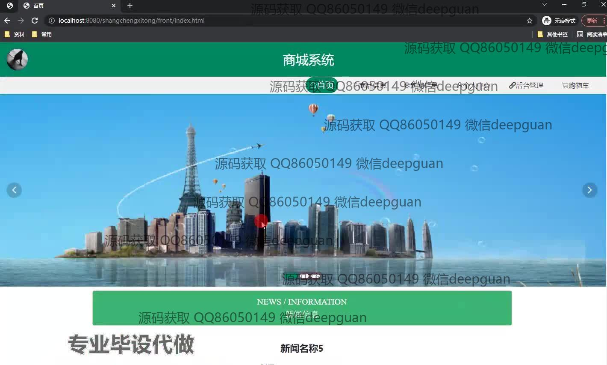
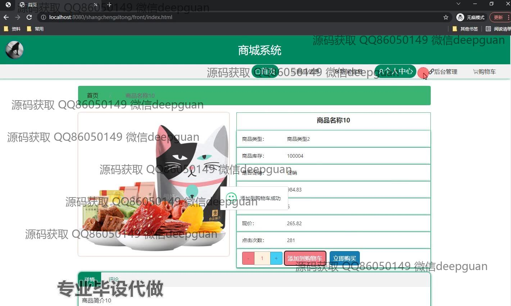
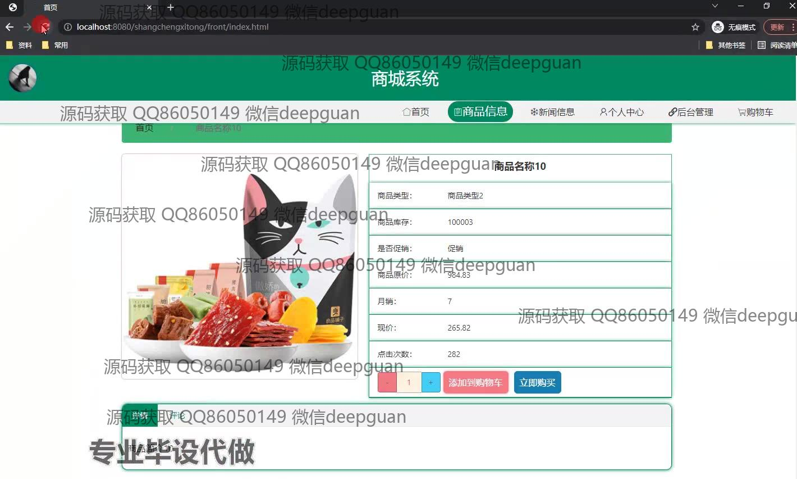
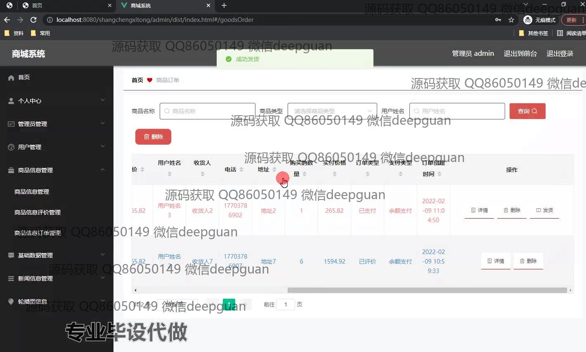
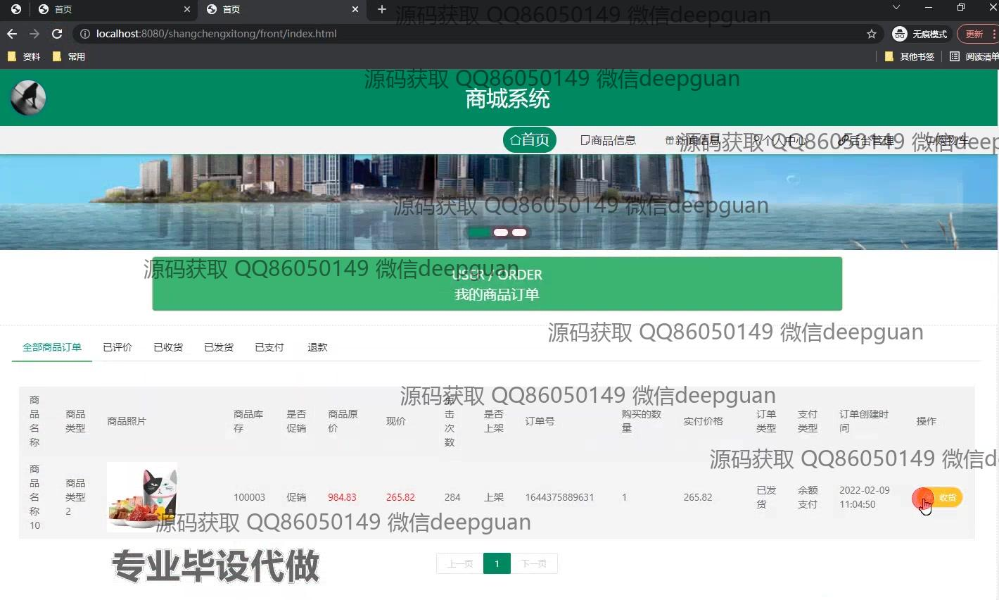
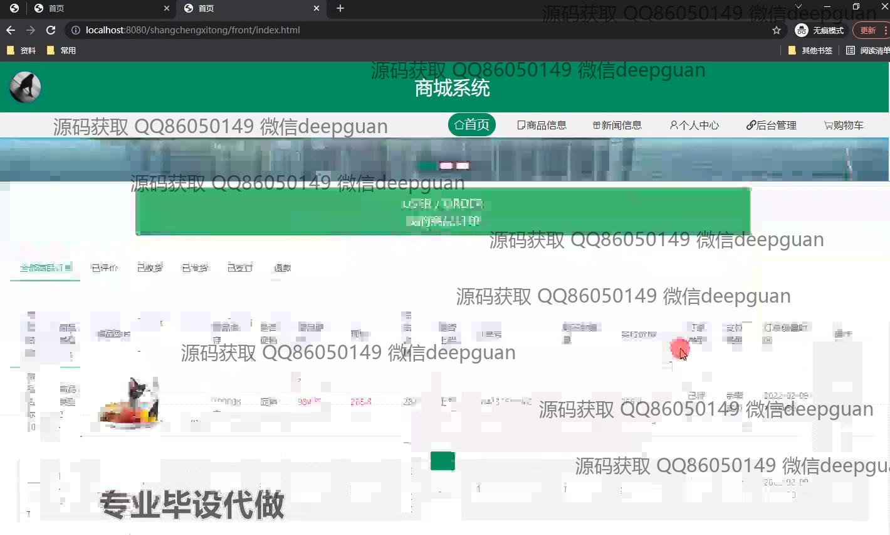
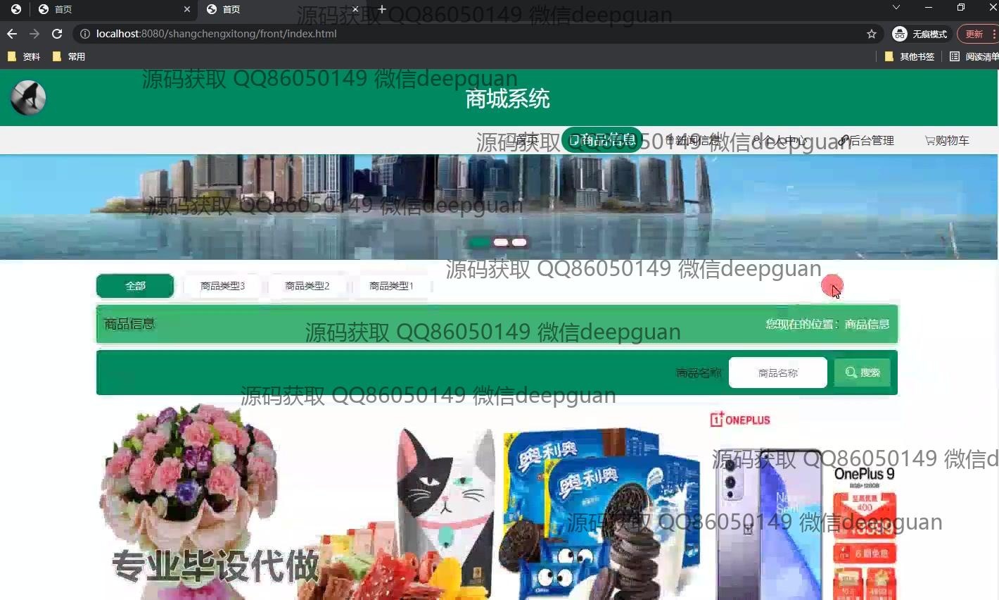
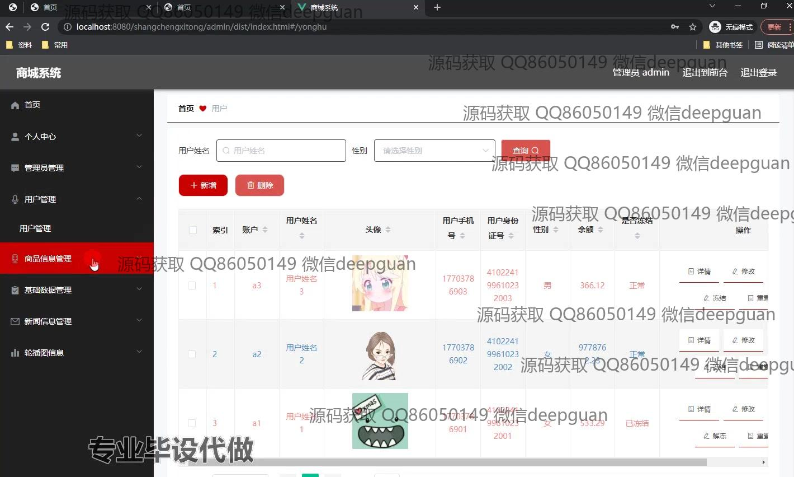
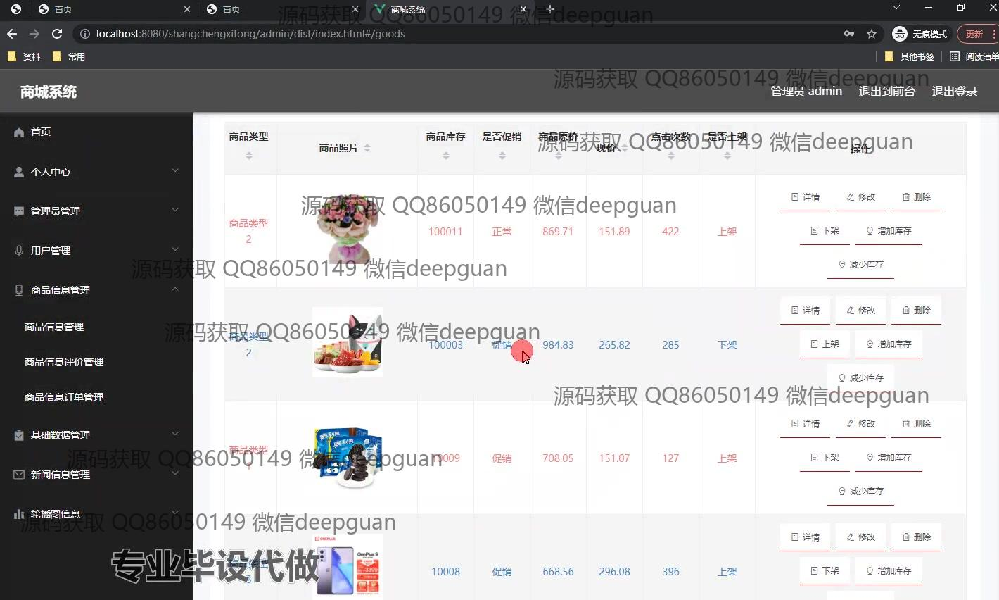
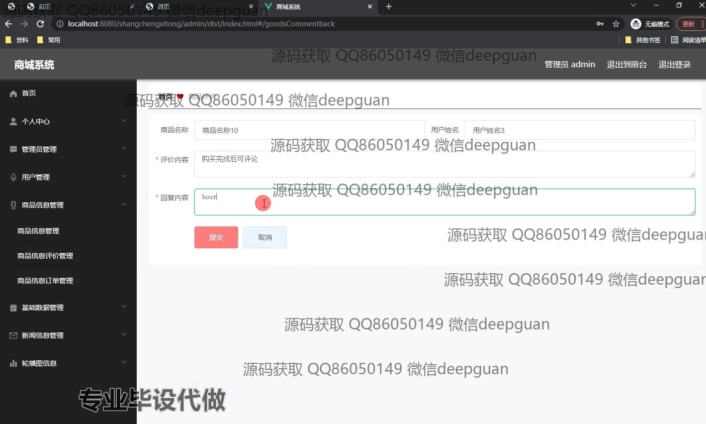
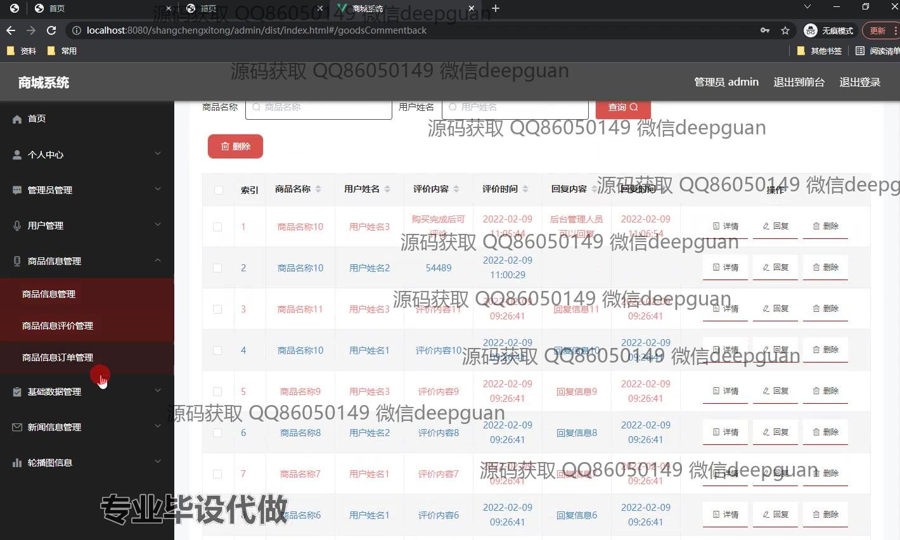
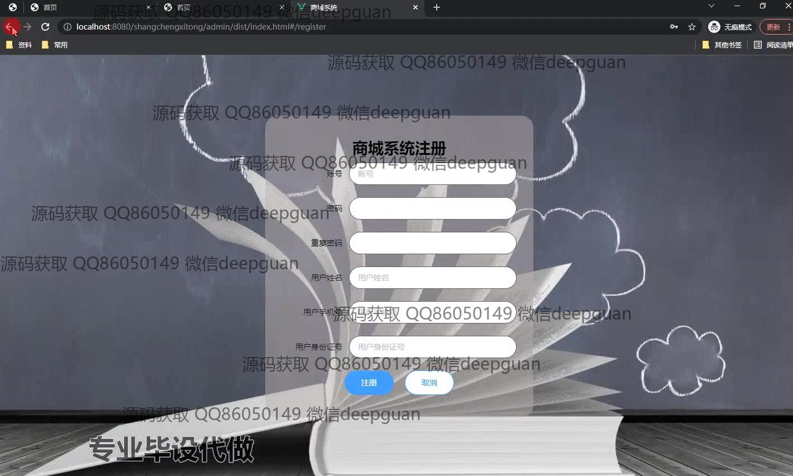
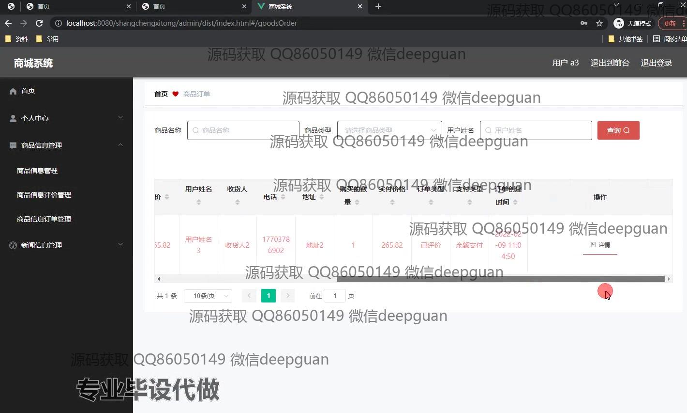

本代码来源于网络,仅供学习参考使用!

